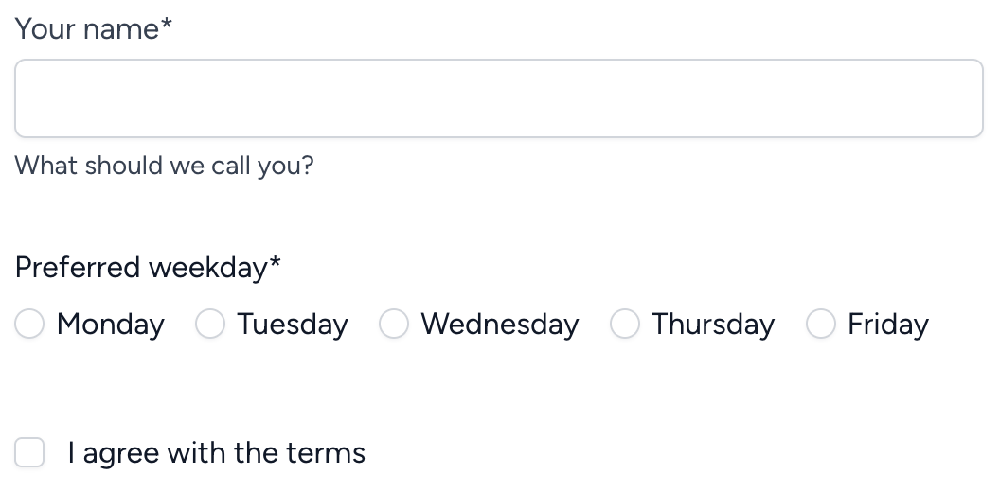
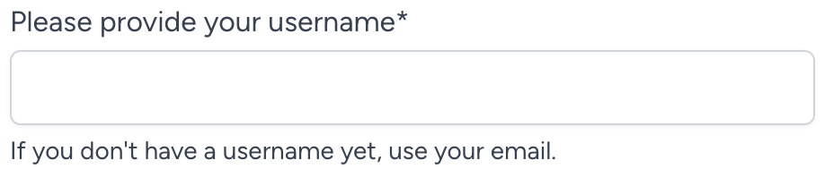
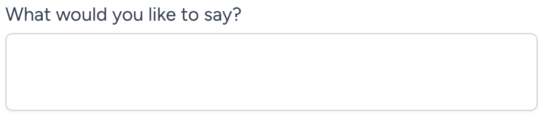
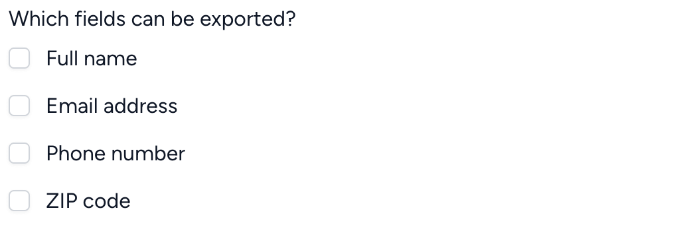
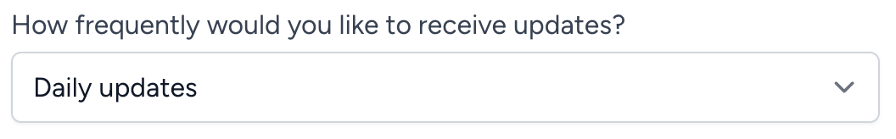

# CSS-agnostic form rendering via Laravel Blade

[](https://packagist.org/packages/gridprinciples/blade-forms)
[](https://github.com/gridprinciples/blade-forms/actions?query=workflow%3Arun-tests+branch%3Amain)
[](https://github.com/gridprinciples/blade-forms/actions?query=workflow%3A"Fix+PHP+code+style+issues"+branch%3Amain)
[](https://packagist.org/packages/gridprinciples/blade-forms)

A set of [Laravel Blade](https://laravel.com/docs/master/blade) components useful for rendering basic, fully-accessible HTML forms in a Laravel app.  The approach is barebones: CSS and JS is not included, but Tailwind (and possibly other framework) presets are planned.

## Installation

You can install the package via composer:

```bash
composer require gridprinciples/blade-forms
```

You can publish the config file with:

```bash
php artisan vendor:publish --tag="blade-forms-config"
```

Optionally, you can publish the views using

```bash
php artisan vendor:publish --tag="blade-forms"
```

## Usage

```blade
<x-form :post="route('form-submission-route')">

    <x-form::input 
        name="name" 
        label="Your name" 
        help="What should we call you?"
        required
        />

    <x-form::radio-buttons 
        name="weekday"
        label="Preferred weekday" 
        :options="[
            'mo' => 'Monday',
            'tu' => 'Tuesday',
            'we' => 'Wednesday',
            'th' => 'Thursday',
            'fr' => 'Friday',
        ]"
        required
        />

    <x-form::checkbox
        name="agree"
        label="I agree with the terms"
        />

</x-form>
```

Result:



### Text Input
Text inputs are, perhaps, the simplest form element.  As with all elements, we can call it using the `x-form` Blade prefix:

```blade
<x-form::input name="username" />
```

We can continue to decorate this input (and apply some readable indentation):

```blade
<x-form::input
    name="username"
    label="Please provide your username"
    help="If you don't have a username yet, use your email."
    required
    />
```

This gives us an input that's ready to use:



We can further customize the attributes of the wrapping `<div>`s and the `<label>`:

```blade
<x-form::input
    name="username"
    label="Please provide your username"
    help="If you don't have a username yet, use your email."
    required
    :wrapperAttributes="[
        'class' => 'form-group-wrapper', 
        'id' => 'username-field',
    ]"
    :labelAttributes="['class' => 'form-label']"
    :inputGroupAttributes="['class' => 'form-input-wrapper']"
    />
```

Results in:

```html
<div class="form-group-wrapper" id="username-field">
    <label for="username_01" class="form-label">
        Please provide your username*
        <span class="sr-only">(required)</span>
    </label>
    <div class="form-input-wrapper">
        <input id="username_01" name="username" type="text" aria-describedby="username_01_feedback" required="">
    </div>
    <div id="username_01_feedback">
        <div>If you don't have a username yet, use your email.</div>
    </div>
</div>
```

### Textarea
The textarea is used nearly identically to the Input component above:

```blade
<x-form::textarea
    name="message"
    label="What would you like to say?"
    rows="2"
    />
```



### Radio buttons
Radio controls should be rendered as a set, with options:

```blade
<x-form::radio-buttons
    name="choice"
    label="Do you think so?"
    :options="[
        'yes' => 'Yes',
        'no' => 'No',
        'maybe' => 'Maybe',
    ]"
    value="maybe" {{-- pre-selected option --}}
    />
```


You can customize the option attributes by passing an array instead of a string as the label.  Here's how to disable the "Maybe" option:

```blade
<x-form::radio-buttons
    name="choice"
    label="Do you think so?"
    :options="[
        'yes' => 'Yes',
        'no' => 'No',
        'maybe' => [
            'label' => 'Maybe',
            'disabled' => true,
        ],
    ]"
    />
```

### Checkbox
A single checkbox can stand alone:

```blade
<x-form::checkbox
    name="remember"
    label="Remember me"
    id="remember_checkbox"
    />
```


Or, you can render a list of options:

```blade
<x-form::checkbox-list
    name="fields"
    label="Which fields can be exported?"
    :options="[
        'name' => 'Full name',
        'email' => 'Email address',
        'phone' => 'Phone number',
        'zip' => 'ZIP code',
    ]"
    />
```



### Select
Select menu inputs must have options, and can be written in a very similar way to radio and checkbox lists: 

```blade
<x-form::select
    name="frequency"
    label="How frequently would you like to receive updates?"
    :options="[
        'sync' => 'As soon as anything happens',
        'daily' => 'Daily updates',
        'weekly' => 'Weekly updates',
        'monthly' => 'Monthly updates',
    ]"
    />
```



### Form
You can optionally create `<form>` elements using this component, which includes some shortcuts to make things cleaner.  Laravel apps typically have something like this:

```blade
<form method="POST" action="{{ route('submission-route') }}">
    @csrf
    @method('PUT')
    {{-- form elements --}}
</form>
```

Using the `<x-form>` component, we can simplify things:

```blade
<x-form :put="route('submission-route')">
    {{-- form elements --}}
</x-form>
```

The component will automatically:
- add the CSRF field
- add the method based on which variable you fill with your submission URL.  You can pass your URL using `get`, `post`, `put`, `patch`, or `delete`, and the method will be set for you.

## Testing

```bash
composer test
```

## Changelog

Please see [CHANGELOG](CHANGELOG.md) for more information on what has changed recently.

## Contributing

Please see [CONTRIBUTING](CONTRIBUTING.md) for details.

## Security Vulnerabilities

Please review [our security policy](../../security/policy) on how to report security vulnerabilities.

## Credits

- [Greg Brock](https://github.com/gridprinciples)
- [All Contributors](../../contributors)

## License

The MIT License (MIT). Please see [License File](LICENSE.md) for more information.
